# TinTro Mobile App

This mobile application

#### Note: source code for the app is moved to other repo

## Demonstration

Videos: Coming soon...

## Main Technical Stack

## User Interfaces
  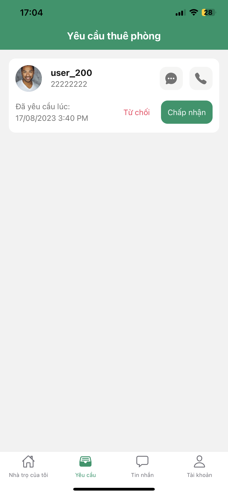
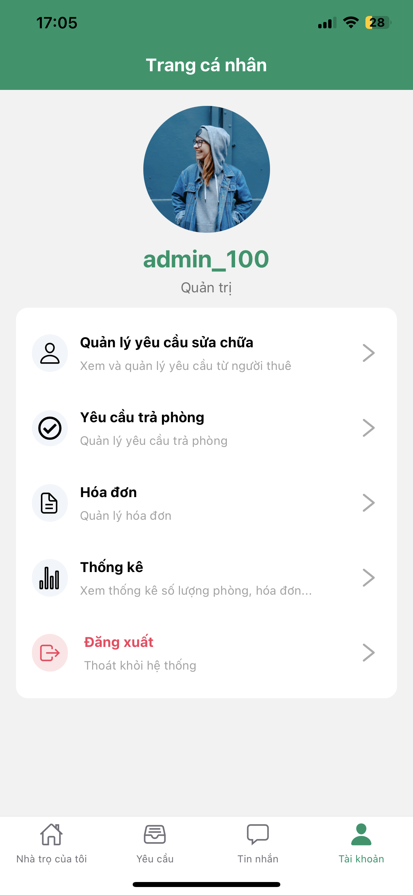  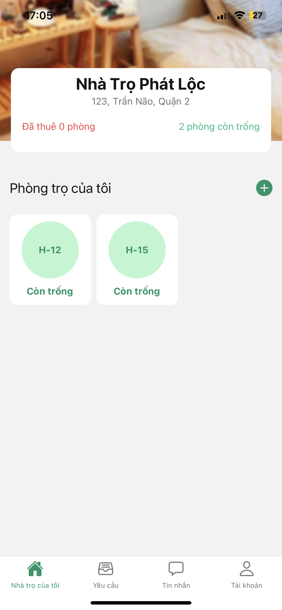
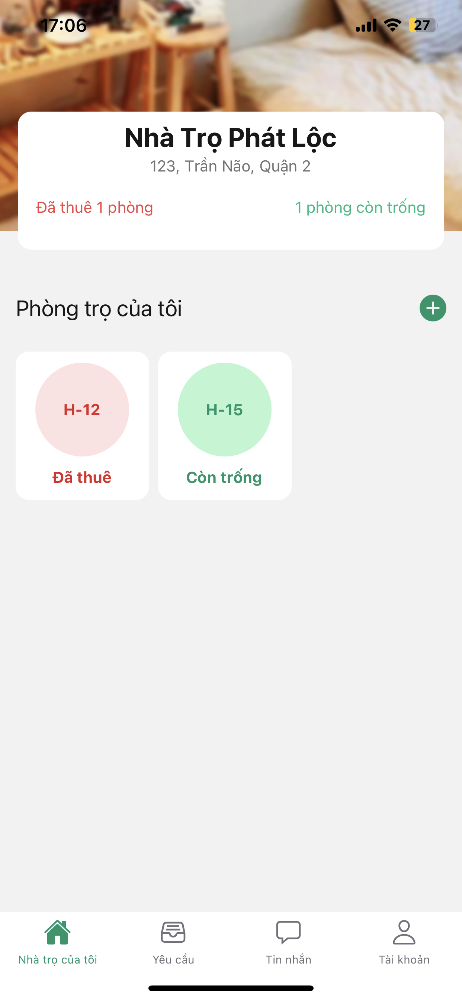  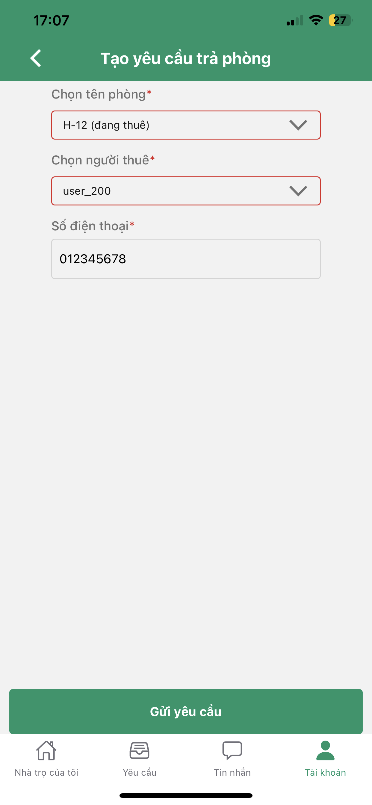
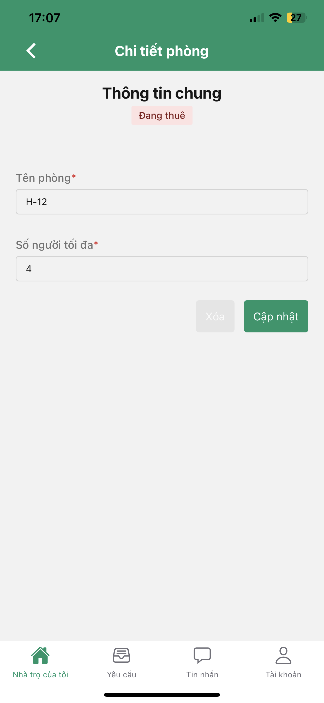  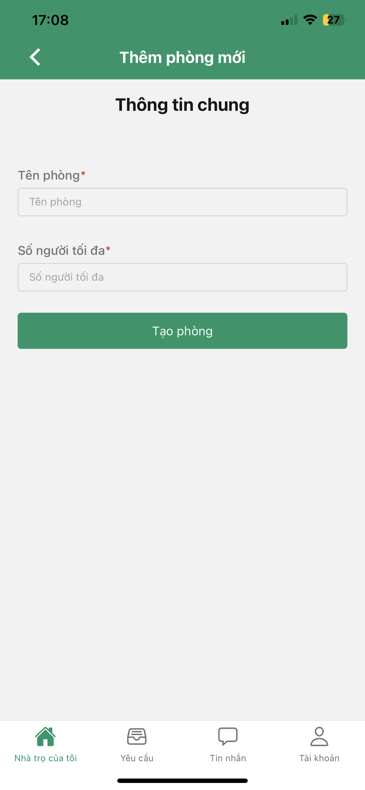
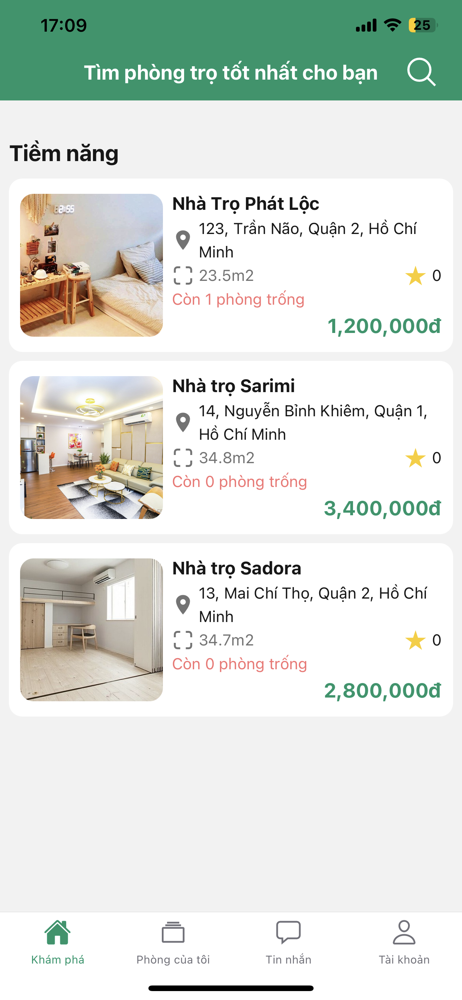  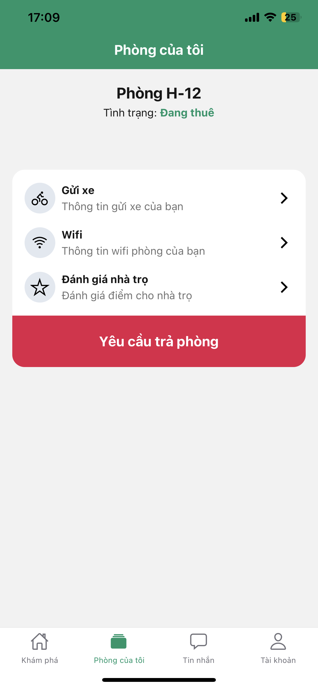
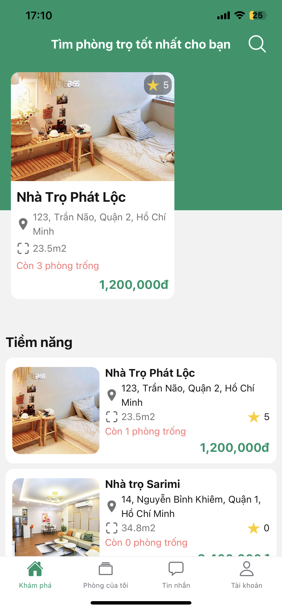  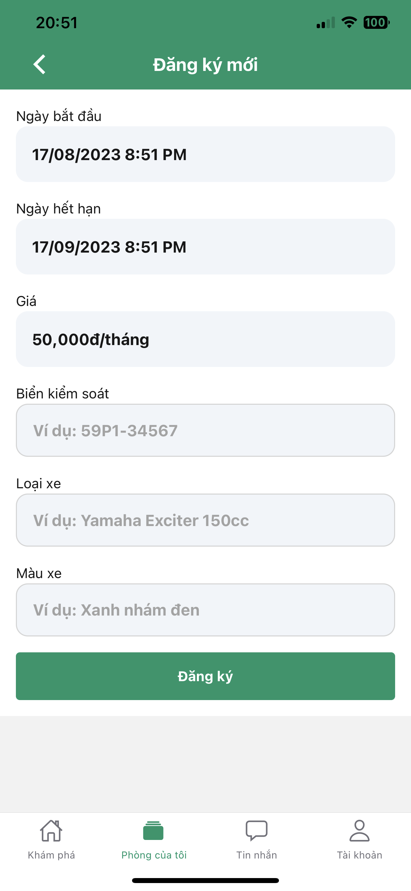
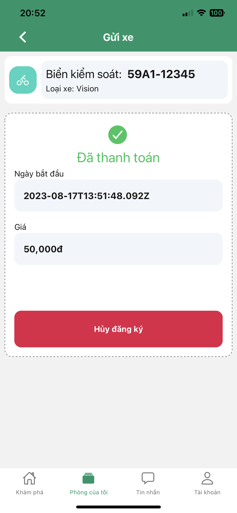  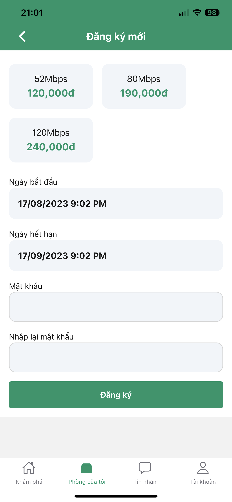
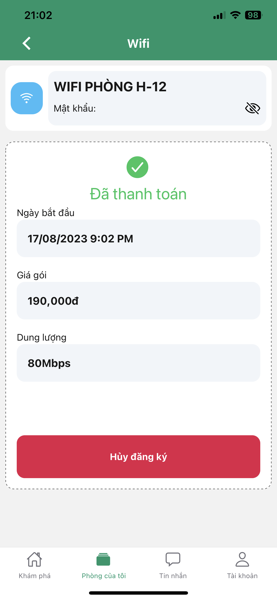  
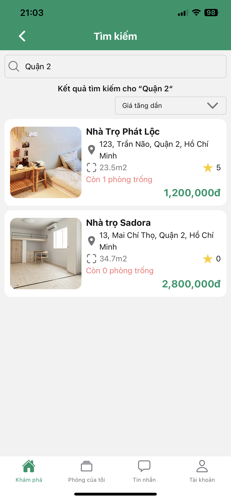  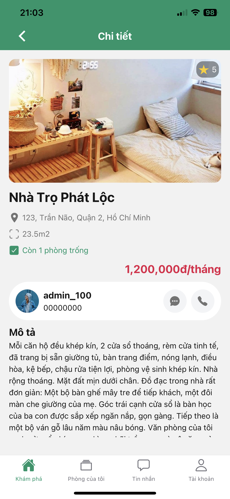
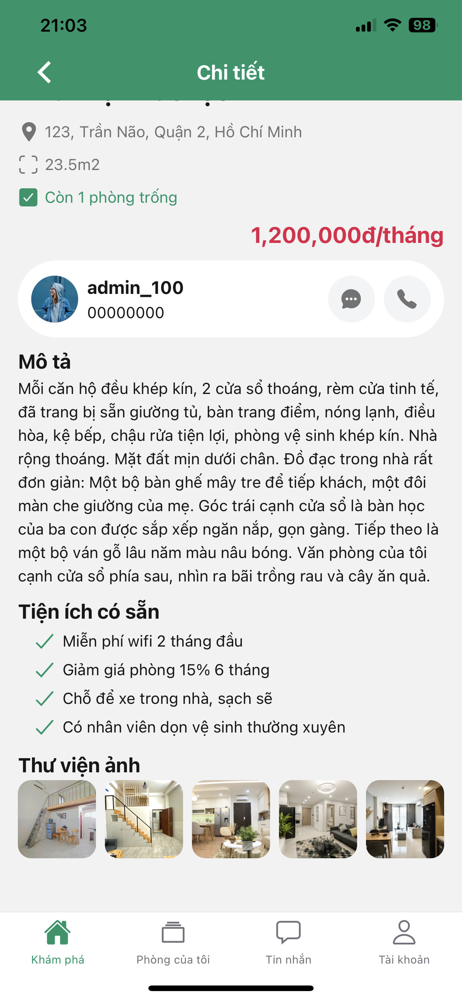  

