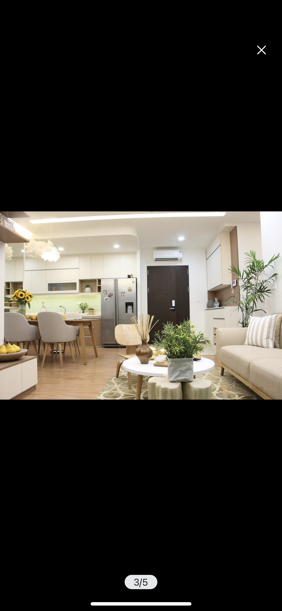

# TinTro Mobile App

This mobile application is an rooming house management. 
  
👉 Owners can promote their accommodation to people. Owner aka admin of the current accommodation can:
- Manage information of rooms
- Request renter to checkout if they realized that, the renter violate the policy
- Accept request rent room from customer
  
👉 Renters find accommodation like they are shopping. Renters can:
- Request to rent the room if they think it is a good choice
- Give a review to the rooming house
- Register for wi-fi and parking slot
- Request checkout the room to owner

## 🛑 Notice 🛑
This application is not publish to the store and currently in maintenance

## Demonstration

Videos: Coming soon...

## Main Technical Stack

## Design

## User Interfaces
  
  
  
  
  
  
  
  
  
  

## Folder Structure

## Maintenance
1. Add feature manage rooming house for owner 
2. Add monthly bill visualization for  
2. Improve performance

## Contribution
Thiên Bảo - [@baonguyen-bku](https://github.com/bao-nguyenbku)
  
Hiếu Đặng [@ThanhHieuDang](https://github.com/ThanhHieuDang0706)